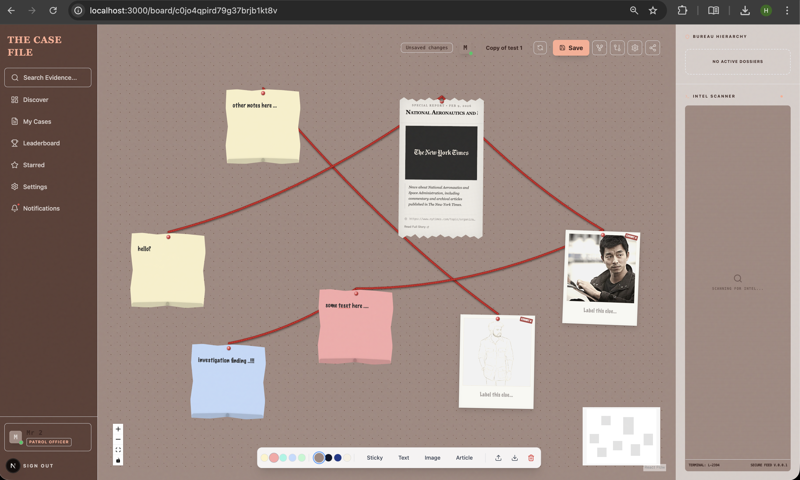
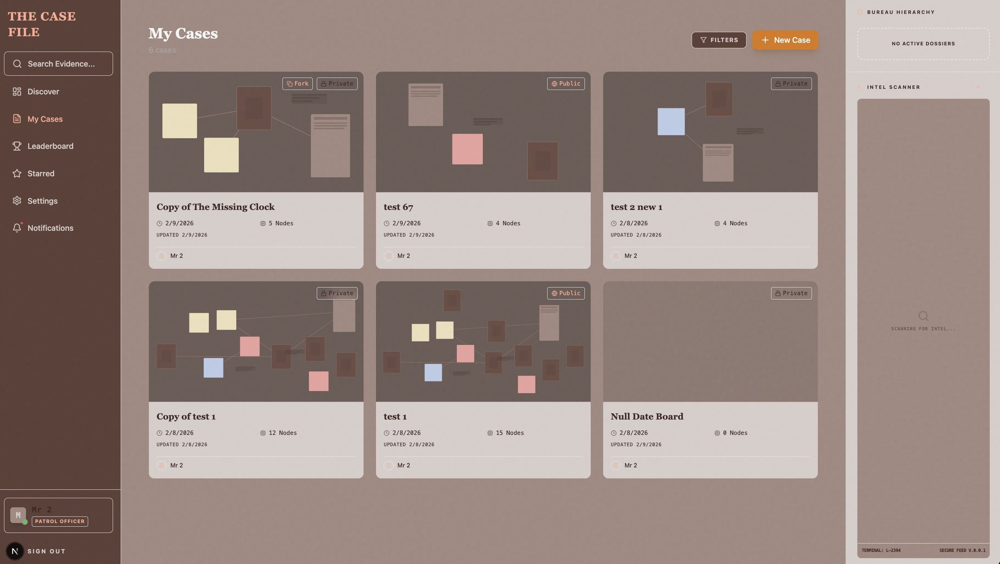
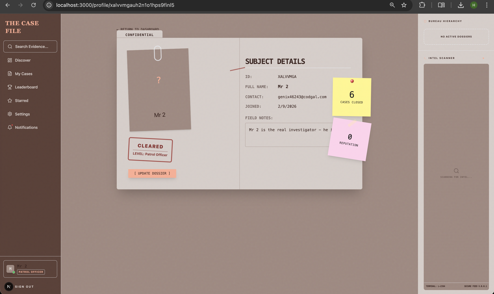
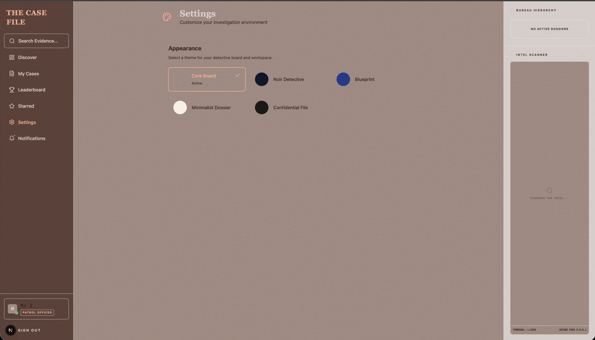
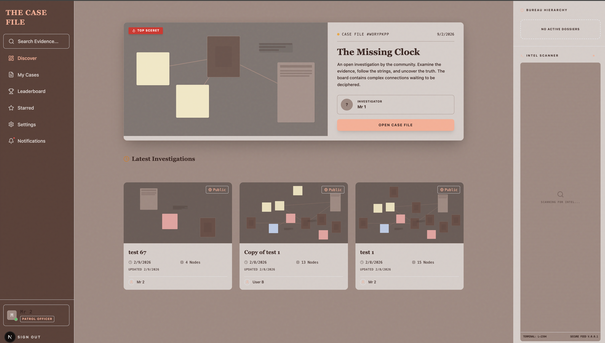
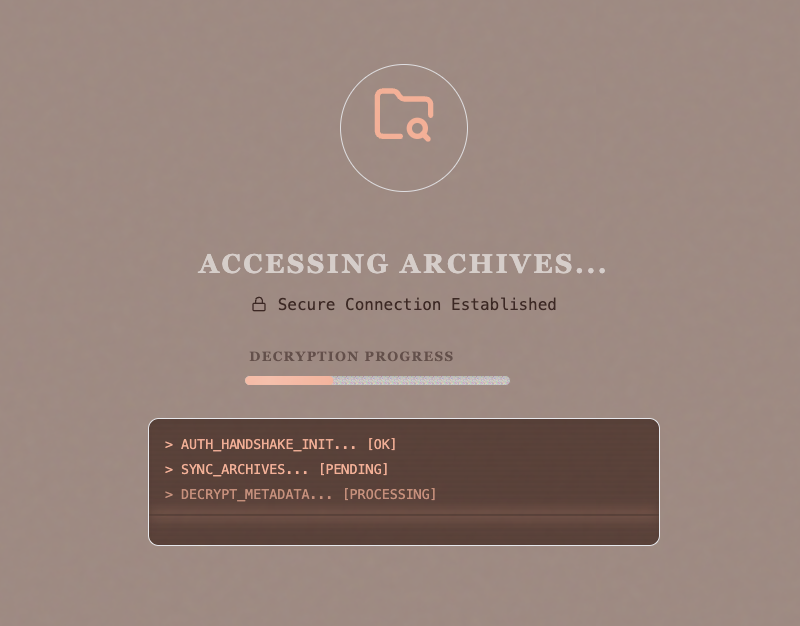

# The Case File 🕵️‍♂️

> *"The truth is a thread waiting to be pulled."*

**The Case File** is a digital investigation board that reimagines how we connect information. Inspired by the classic "detective board" aesthetic, it provides an infinite canvas where investigators (users) can piece together evidence, draw connections with red strings, and collaborate on solving complex cases.

Built with a "Noir" aesthetic, this application isn't just a productivity tool—it's an immersive experience for organizing thoughts, research, and collaborative projects.

---

## 📸 Evidence Gallery

| **The Investigation Board** | **Case Dashboard** |
|:---:|:---:|
|  |  |
| *Infinite canvas with sticky notes, articles, and evidence nodes connected by dynamic red strings.* | *Manage your private and public cases in a secure, classified environment.* |

| **Detective Dossier** | **Secure Settings** |
|:---:|:---:|
|  |  |
| *Track your reputation, case history, and detective rank.* | *Customize your workspace environment.* |

| **Case Discovery** | **Secure Access** |
|:---:|:---:|
|  |  |
| *Explore public cases and featured investigations.* | *Immersive loading screens verifying detective credentials.* |

---

## 🕵️‍♀️ Core Features

### 1. The Investigation Board (Canvas)
- **Infinite Workflow**: powered by ReactFlow, allowing endless panning and zooming.
- **Evidence Nodes**:
    - 📝 **Sticky Notes**: Quick thoughts and scribbles.
    - 📄 **Articles**: Rich text content with headlines.
    - 🖼️ **Images**: Visual evidence upload.
    - 🔗 **Links**: External resources.
- **Red Strings**: Dynamically connect any two nodes to visualize relationships. The strings sag and jitter slightly to mimic real thread.
- **Real-time Collaboration**: See other detectives moving evidence on the board in real-time.

### 2. Detective Reputation System
- **Gamified Experience**: Earn "Reputation Points" for contributing to public cases.
- **Ranks**: Progress from *Rookie* to *Chief Inspector* based on your activity.
- **Leaderboard**: Compete with other investigators for the top spot.

### 3. Collaboration & Contribution
- **Public & Private Cases**: Keep your investigation secret or open it to the bureau.
- **Forking**: "Fork" a public case to create your own line of inquiry without affecting the original.
- **Contribution Requests**: Suggest changes to a public board. The owner can review, **Merge**, or **Reject** your evidence.
- **Comments**: Discuss specific pieces of evidence directly on the board.

### 4. Security & Architecture
- **Secure Authentication**: Email/Password and Social login via NextAuth 5 (Beta).
- **Role-Based Access**: Granular permissions (Owner, Editor, Viewer).
- **Rate Limiting**: Custom implementation to prevent brute-force attacks on the bureau's servers.

---

## 🏗️ Technical Architecture

The Case File is a modern full-stack application built for performance, interactivity, and edge deployment.

### Tech Stack

- **Framework**: [Next.js 15](https://nextjs.org/) (App Router)
- **Language**: TypeScript
- **Database**: [Turso](https://turso.tech/) (LibSQL) - Edge-ready distributed database.
- **ORM**: [Drizzle ORM](https://orm.drizzle.team/) - Type-safe SQL builder.
- **Canvas Engine**: [ReactFlow](https://reactflow.dev/)
- **Styling**: [Tailwind CSS](https://tailwindcss.com/) with `tailwindcss-animate`.
- **State Management**: [Zustand](https://github.com/pmndrs/zustand).
- **Authentication**: [Auth.js](https://authjs.dev/) (NextAuth v5).
- **Validation**: [Zod](https://zod.dev/).

### Data Model

The application uses a relational model designed for flexibility:

- **Users**: Extended with `reputation`, `ranks`, and `bio`.
- **Boards**: The core entity, containing a JSON blob for the canvas state (`nodes` and `edges`).
- **Contributions**: Stores "snapshots" of board states proposed by other users.
- **Comments**: Threaded discussions linked to boards or specific nodes.

---

## 🚀 Getting Started

Follow these steps to set up your local precinct.

### Prerequisites

- Node.js 18+
- npm or pnpm
- A [Turso](https://turso.tech/) database account.

### Installation

1. **Clone the repository**
   ```bash
   git clone https://github.com/hardikrawat/the-case-file.git
   cd the-case-file
   ```

2. **Install dependencies**
   ```bash
   npm install
   ```

3. **Configure Environment**
   Create a `.env.local` file in the root directory:
   ```env
   # Database (Turso)
   TURSO_DATABASE_URL="libsql://your-db-name.turso.io"
   TURSO_AUTH_TOKEN="your-turso-auth-token"

   # Authentication
   AUTH_SECRET="generated-secret" # Run `npx auth secret` to generate
   AUTH_URL="http://localhost:3000"

   # Optional: Email Service (Resend/Nodemailer)
   # EMAIL_SERVER_USER=...
   # EMAIL_SERVER_PASSWORD=...
   ```

4. **Initialize Database**
   Push the schema to your Turso database:
   ```bash
   npx drizzle-kit push
   ```

5. **Start the Development Server**
   ```bash
   npm run dev
   ```

   Open `http://localhost:3000` to begin your investigation.

---

## 📂 Project Structure

```
src/
├── app/                 # Next.js App Router pages and API routes
│   ├── (authenticated)/ # Protected routes (Dashboard, Board, Profile)
│   ├── api/             # API Endpoints (Trpc-like pattern with Route Handlers)
│   └── login/           # Public auth pages
├── components/
│   ├── board/           # Canvas specific components (Toolbar, Minimap)
│   ├── nodes/           # Custom ReactFlow nodes (StickyNote, Article)
│   └── ui/              # Reusable UI components (Buttons, Modals)
├── lib/
│   ├── db.ts            # Database connection
│   ├── schema.ts        # Drizzle schema definitions
│   └── auth.ts          # NextAuth configuration
└── hooks/               # Custom React hooks (useBoard, useAutoSave)
```

---

## 🤝 Contributing

The bureau welcomes new detectives. If you have an idea for a feature or a fix:

1. Fork the repository.
2. Create a new branch (`git checkout -b feature/evidence-locker`).
3. Commit your changes.
4. Push to the branch and open a Pull Request.

---

## 📄 License

This is a hobby project. All rights reserved.
